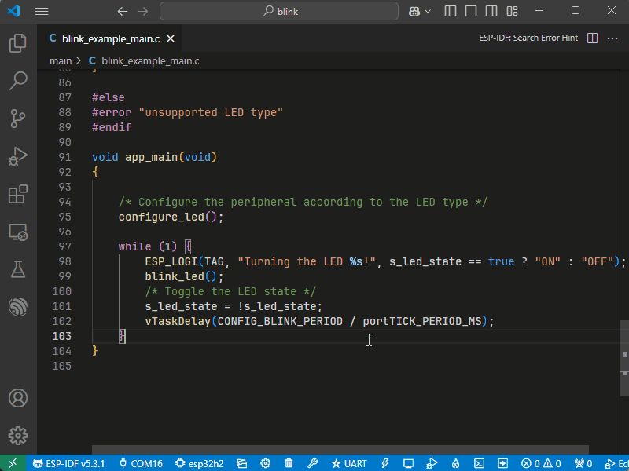

# Customize Your ESP32's Memory Layout with Partition Table Editor

## Description
The Partition Table Editor provides a user-friendly interface to define and modify your ESP32's flash memory layout. You can create custom partitions for your application, data, and bootloader with just a few clicks.

## Features
- Visual partition table editing interface
- Automatic CSV file generation and management
- Direct integration with ESP-IDF build system
- Real-time validation of partition configurations

## Try it yourself
1. Run the command`ESP-IDF: SDK Configuration Editor`
2. Open editor by running the command `ESP-IDF: Open Partition Table Editor UI`
3. If you haven't enabled custom partition table, you will be asked if you want to.

## Did you know?
💡 The editor automatically validates your partition layout to ensure it meets ESP32 requirements and prevents common configuration mistakes.

## Resources
- [Partition Table Editor Documentation](https://docs.espressif.com/projects/vscode-esp-idf-extension/en/latest/additionalfeatures/partition-table-editor.html)
- [ESP-IDF Partition Tables documentation](https://docs.espressif.com/projects/esp-idf/en/latest/esp32/api-guides/partition-tables.html)